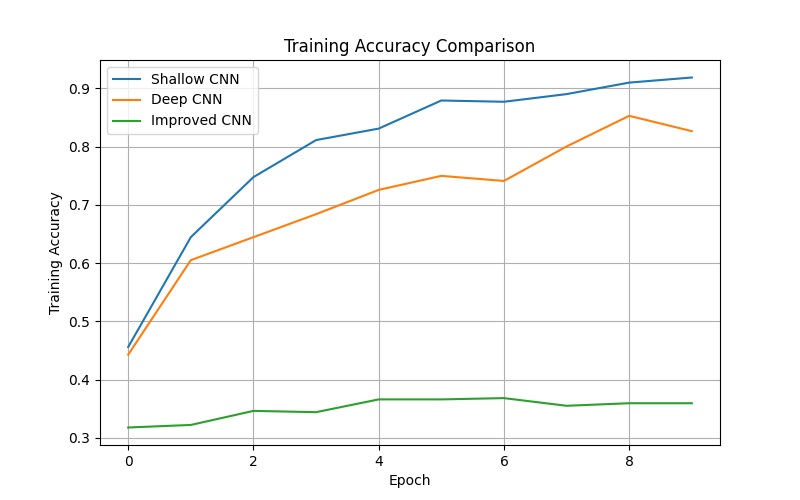
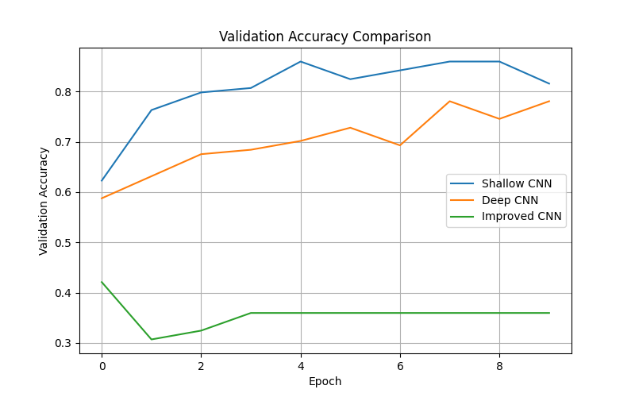
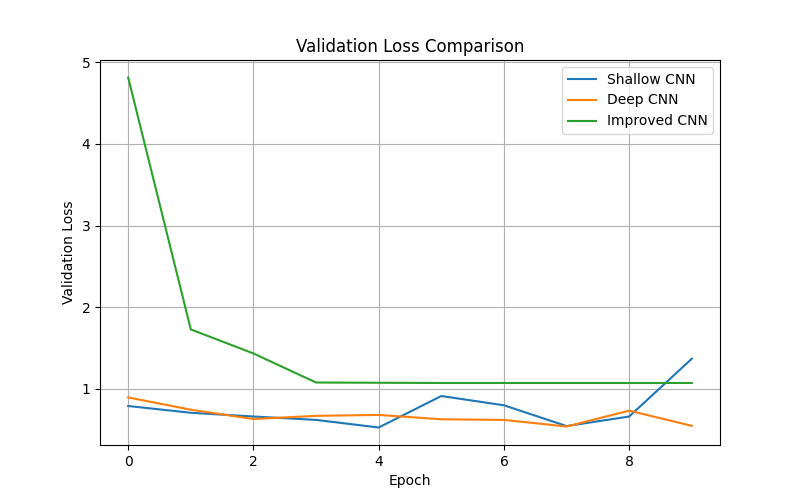
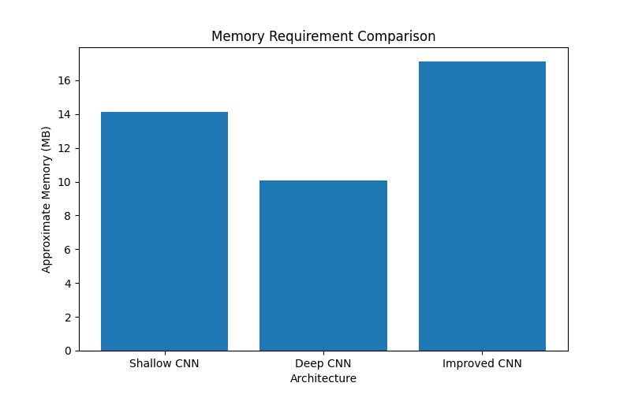

# Deep Learning Architectural Challenges for Video Action Recognition

## 1. Project Overview

This project demonstrates the architectural challenges that occur when increasing the depth of a Deep Learning model for video action recognition.

The system classifies three human actions:

- Walk
- Stand Up
- Sit Down

Two main CNN architectures are compared:

1. Shallow CNN
2. Deep CNN

An improved CNN using Batch Normalization and Dropout is also implemented to address training difficulties and overfitting.

---

## 2. Problem Statement

A video-indexing platform increases network depth to recognize complex actions but experiences growing memory usage, computation, and training difficulty.

This project investigates these challenges using a small CNN-based action recognition implementation.

The models are compared based on:

- Number of parameters
- Approximate parameter memory
- Training time
- Training accuracy
- Validation accuracy
- Training loss
- Validation loss
- Gradient behavior

---

## 3. Objectives

The main objectives are:

- To implement a shallow CNN for action classification.
- To implement a deeper CNN architecture.
- To analyze the effect of increasing network depth.
- To compare memory and computational requirements.
- To study training difficulty using gradient analysis.
- To implement architectural improvements.
- To analyze the benefits of Batch Normalization and Dropout.

---

## 4. Dataset

A human activity video dataset is used for this project.

Only three action classes are selected:

| Class | Action |
|---|---|
| 1 | Walk |
| 2 | Stand Up |
| 3 | Sit Down |

The original dataset contains additional action classes, but they are not used because this project is limited to the assigned problem.

---

## 5. Data Preprocessing

The input data consists of videos.

Selected frames are extracted from each video using OpenCV.

For each video:

1. The video is opened.
2. Total number of frames is obtained.
3. Ten frames are selected at approximately equal intervals.
4. Frames are saved as JPEG images.
5. The extracted frames are organized according to their action class.

Example:

```text
Video
  |
  v
Frame Extraction
  |
  v
Image Frames
  |
  v
CNN Model
## 10. Experimental Results

The three architectures were evaluated using the same dataset and training settings.

| Model | Parameters | Training Accuracy | Validation Accuracy |
|---|---:|---:|---:|
| Shallow CNN | YOUR_VALUE | YOUR_VALUE% | YOUR_VALUE% |
| Deep CNN | YOUR_VALUE | YOUR_VALUE% | YOUR_VALUE% |
| Improved CNN | YOUR_VALUE | YOUR_VALUE% | YOUR_VALUE% |
### Accuracy Comparison



### Validation Accuracy



### Loss Comparison



### Parameter Comparison


### Memory Comparison



## 11. Analysis

The experimental results show the effect of increasing architectural depth.

The Deep CNN contains more convolutional layers than the Shallow CNN. 
This increases the number of learnable parameters and computational requirements.

The increased model complexity can also make training more difficult, 
especially when the available dataset and computational resources are limited.

The Improved CNN incorporates Batch Normalization and Dropout. 
Batch Normalization helps stabilize the training process, while Dropout 
helps reduce overfitting.

Therefore, increasing depth should be balanced with computational resources, 
dataset size, memory availability, and training stability.
## 12. Conclusion

This project analyzed the major architectural challenges associated with 
increasing the depth of Deep Learning networks for video action recognition.

The comparison between Shallow CNN and Deep CNN demonstrates that deeper 
architectures can require more parameters, memory, and computation.

The project also investigated training difficulty using gradient analysis.

Batch Normalization and Dropout were introduced as architectural techniques 
to improve training stability and reduce overfitting.

The results demonstrate that deeper networks should be designed carefully 
according to the complexity of the task and the available computational resources.